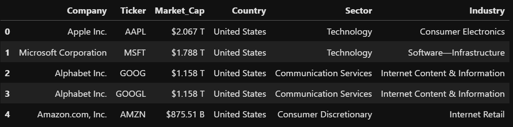
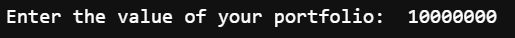
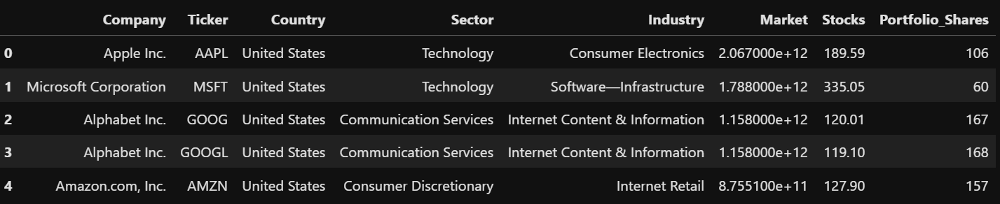

# Equal Weight S&P 500 Index Fund

## What is Algorithmic Trading?
According to [investopedia](https://www.investopedia.com/articles/active-trading/101014/basics-algorithmic-trading-concepts-and-examples.asp) algorithmic trading aka black-box trading uses computer program to follow a defined set of instructions to place a trade. The trade, in theory, can generate profits at a speed and frequency that is impossible for a human trader.

## Why Algorithmic Trading?
In an article by [straitsresearch](https://straitsresearch.com/report/algorithmic-trading-market), the global algorithmic trading market size was valued at USD 35701 million in 2021. It is expected to reach USD 104971.2 million at a compound annual growth rate (CAGR) of 12.73% during the period of 2022-2030.

## Major players:
1. 63MOONS
2. Virtu Financial
3. Software AG
4. Refinitiv Ltd.
5. MetaQuotes Software Corp.

## Algorithmic Trading Process

The process of running a quantitive investing strategy can be broken down into the following steps:

1. Collect Data
2. Develop a hypothesis for a strategy
3. Backtest that strategy
4. Implement the strategy in production

## Aim
The aim of this project is to explore the construction of an index fund that ensures equitable distribution of portfolio funds among selected shares. The objective is to provide users with guidance on the optimal allocation of shares based on their input funds. Furthermore, we envision expanding the dataset to encompass a wider range of company stocks beyond the S&P500 in the future.

## What is an API

API is an Application Programming Interface.

here is some to ways to practice api: [github](github.com/public-apis/public-apis)

## What is S&P 500?

S&P500: The Standard and Poor's 500 company

S&P 500 is the world's most popular stock market index. Many investment funds are benchmarked to S&P 500. This means that they seek to replicate the performance of the index by owning all the stocks that are held in the index.

One of the most important characteristics of S&P 500 is that it is market capitalization-weighted. (this means that larger companies get a correspondingly larger weight in the index).

Here are the list of company that has been webscrapped:

A calculator was written to calculate the amount of stocks to buy when an input portfolio is given.

After calculations, as seen in the table below, the amount of stocks to purchase can be found on the most right of the table. This data can be exported and passed to downstream for traders to make the necessary purchases.

